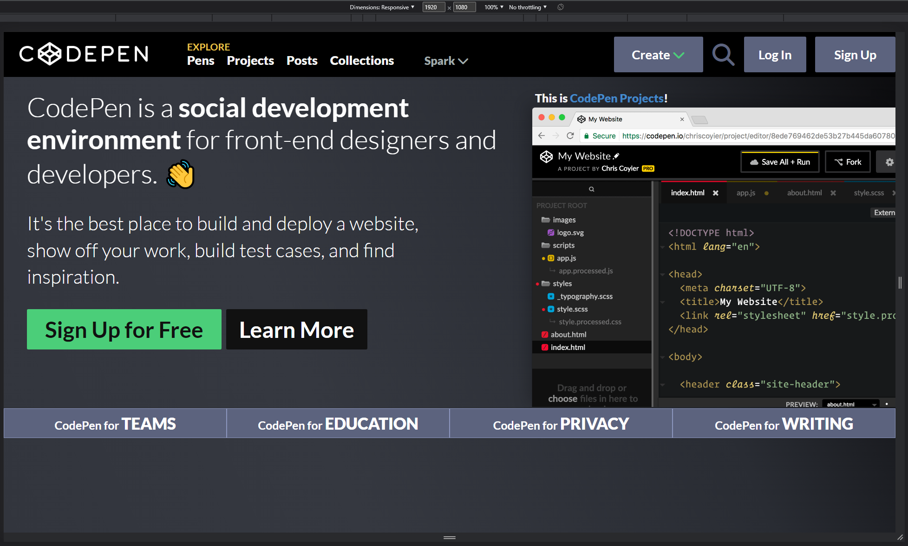

# **Coding  Foundations Final Project (CodePen)**

> Replicate the **CodePen.io** homepage (just the landing page section) using as a reference the provided template photo.

### __Minimun Required Subtasks__
- [x] Navbar that includes: "Pens, Projects, Posts, Collections, and Spark with a down chevron (does not need to actually dropdown).
- [x] Images - use available tools to recreate colors, etc.
- [x] Simply replicate the landing page (Don't worry about replicating any functionality features such as drop-down, scrolling, etc)

### __Extra Subtasks__
- [x] Add basic animations (hover, button click, etc)
- [x] Add responsive design (Medium, Wide and Ultrawide screens)
- [ ] Add mobile design (Small screens)

## **WEB DESIGN**
### __Web structure__
The project uses a single `.html` file (`index.html`). The HTML structure of the `head` is:
- **CSS Stylesheets references**: there are 7 Stylesheets
    - `Button.css`: contains all the styles of the basic button (most of these are override with the specific characteristics of the button).
    - `helpers.css`: contains styles related to helpers (i.e. an extra separation between elements).
    - `background.css`: contains the background image styles and positioning.
    - `common.css`: contains common styles of all the web pages (i.e. fonts and generic elements styles).
    - `navbar.css`: contains navbar styles and elements positioning.
    - `content.css`: contains styles and elements positioning of the main content of the web (headers, paragraphs, images, etc).
    - `footer.css`: contains styles and element positioning of the footer.
- **Fonts references**: the main font of the project is `Lato`.
- **Awesome font references**: basic icons.

The HTML structure of the `body` is:

- **Main div** (`bg-content-section`): this part of the web is the background image, all the other elements are posicioned over this image.
    - **First section div** (`navbar`): contains all the elements of the navbar (the 5 anchors and the Create, Login and Sign Up buttons).
    - **Second section div** (`content-section-wrapper`): contains the header, paragraphs, buttons and side image of the main content of the web.
    - **Third section div** (`footer-section-wrapper`): contains the 4 columns of the footer with information about codePen main characteristics.

## **WEB DIAGRAM**
### __Navbar section__

A combination of `CSS basic translations` and `Flexbox` is used to position the elements on the navigation bar.

### __Main Content section__

Just `Flexbox` is used to position the elements on the navigation bar.

### __Footer section__

Just `Flexbox` is used to position the elements on the navigation bar.

## **FINAL RESULT**
The web is designed using `relative units (vw, %, etc)` and support a wide variety of monitors. For the mobile version, `media-queries` has been used.
### __Ultrawide Size Screen (3440x1440p)__

### __Wide Size Screen (1920x1080p)__

### __Medium size Screen (1280x720p)__

